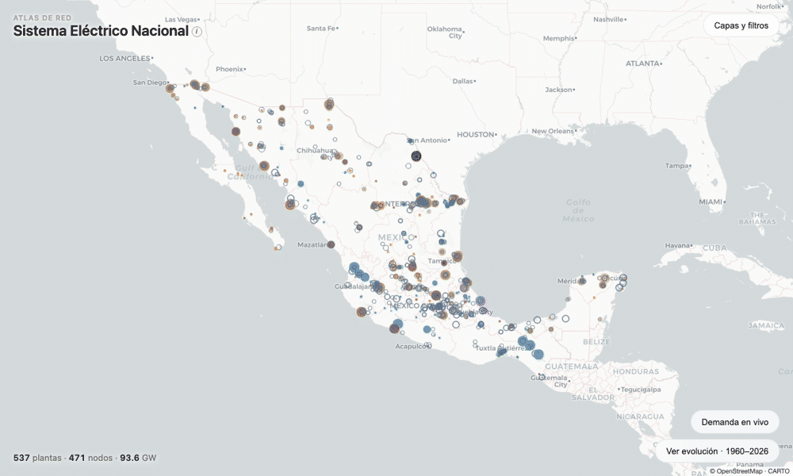

# Atlas de Red — SEN

An interactive map of Mexico's national electricity system (Sistema Eléctrico Nacional): generation plants, the 400/230 kV transmission grid, CENACE control regions, CFE tariff divisions, and near‑real‑time demand — reconstructed from public sources, geolocated, and enriched.

**Live demo:** https://batuenergy.com/atlas · **Maintained by** [Batu Energy](https://batuenergy.com)



## What it shows

- **Generación** — ~540 power plants by source, owner, market (MEM/Legado), size, and commissioning date (COD), with a 1960–2026 build‑out timeline.
- **Red 400/230 kV** — ~470 high‑voltage substations with transformer capacity and saturation.
- **Líneas de transmisión** — real routed high‑voltage line geometry from OpenStreetMap.
- **Subestaciones de distribución** — ~2,000 distribution / sub‑transmission substations (≤161 kV) from OpenStreetMap, plus per‑division transformer capacity from CFE's RGD short‑circuit report.
- **Regiones de control (CENACE)** and **Zonas tarifarias CFE (17)** as choropleths.
- **Demanda en vivo** — semi‑real‑time demand / generation / forecast per region, from CENACE.
- **Usuarios · consumo · GD (evolución)** — year‑by‑year choropleths: estimated users and energy sales per tarifa per división tarifaria (CNE memorias de cálculo), and distributed‑generation capacity per state + by system size (CNE/CRE GD reports).

## Why

The data exists, but scattered across PDFs, portals, and incompatible formats. This puts the whole system on one map — useful for siting, interconnection, congestion analysis, and energy education in Mexico.

## Architecture

A deliberately **dependency‑free** static site: a single Leaflet map that loads modular JSON at runtime. No framework, no build step required to view it — host it anywhere (it runs from `file://`). The data is produced by a reproducible Python pipeline.

```
src/            # the map (html / css / js)
scripts/        # data pipeline: extract → geocode (OSM) → dissolve → build
data/sources/   # raw/derived inputs + provenance (see data/SOURCES.md)
public/         # built site + runtime JSON (the deployable artifact)
tests/          # pytest (data transforms) + Playwright (UI regressions)
```

## Quickstart

```bash
make setup      # create venv, install deps
make data       # run the pipeline (fetch + transform) → data/derived
make build      # assemble the map → public/
make serve      # serve public/ at http://localhost:8765
make test       # pytest + playwright
```

## Talk to the data (MCP)

`atlas_mcp.py` is a [Model Context Protocol](https://modelcontextprotocol.io) server that lets an LLM
(Claude, etc.) query the whole dataset in natural language — no database or API key. It reads the same
open JSON the map serves and exposes typed tools: `query_generation`, `query_demand` (live),
`query_distributed_generation`, `query_tarifa` (users & energy), `query_substations`, and
`list_dimensions`. Proprietary‑geocoded coordinates are **not** exposed — only public attributes and
aggregates.

```bash
pip install -r requirements.txt
python atlas_mcp.py        # stdio MCP server
```

Add it to an MCP client (Claude Desktop / Claude Code `.mcp.json`):

```json
{ "mcpServers": { "atlas-sen": { "command": "python", "args": ["/abs/path/to/atlas_mcp.py"] } } }
```

Then ask things like *"how much distributed generation did Jalisco add between 2022 and 2024?"*,
*"which tariff division has the most GDMTH users?"*, or *"what's national demand right now?"* —
every answer carries its CNE/CFE/INEGI source.

## Data & licensing

Code is **MIT**. Data carries the license of its upstream source — see [`data/SOURCES.md`](data/SOURCES.md) for a per‑dataset provenance table and [`DATA-LICENSE.md`](DATA-LICENSE.md). In short: OpenStreetMap‑derived data is **ODbL** (attribution + share‑alike); CENACE/CFE/INEGI‑derived data is public‑sector / **CC‑BY**. Plant/substation **coordinates** are geocoded with a proprietary service, so they are **not** part of the open dataset — the map loads them at runtime from a Batu‑hosted endpoint. (Re‑sourcing them from OpenStreetMap to make the dataset fully self‑contained is a welcome contribution — see `METHODOLOGY.md`.)

Methodology, assumptions, and known limitations: [`METHODOLOGY.md`](METHODOLOGY.md).

## Contributing

Issues and PRs welcome — see [`CONTRIBUTING.md`](CONTRIBUTING.md). Good first areas: improving substation↔OSM matching, filling transmission‑line gaps, and new data layers.

## Acknowledgements

Built on open data from **CENACE**, **CFE**, **INEGI/CONABIO**, **SENER/DOF**, and **OpenStreetMap contributors**.
